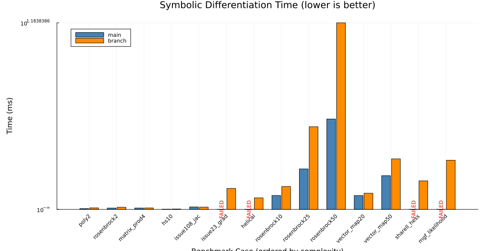
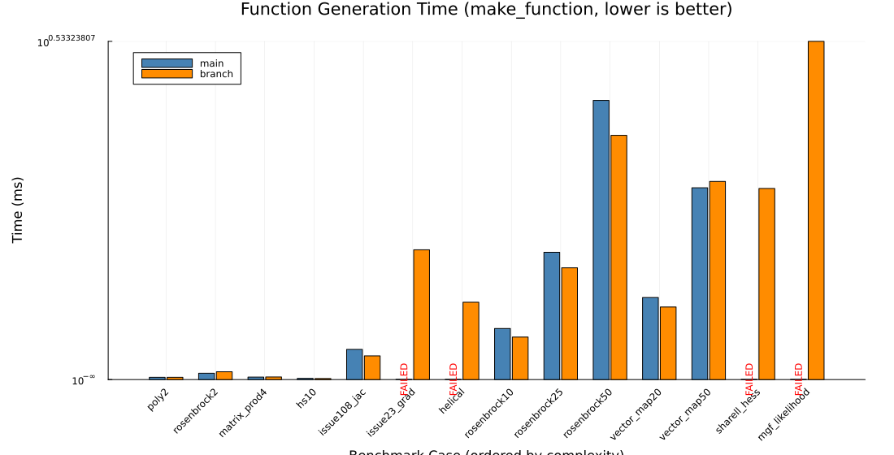
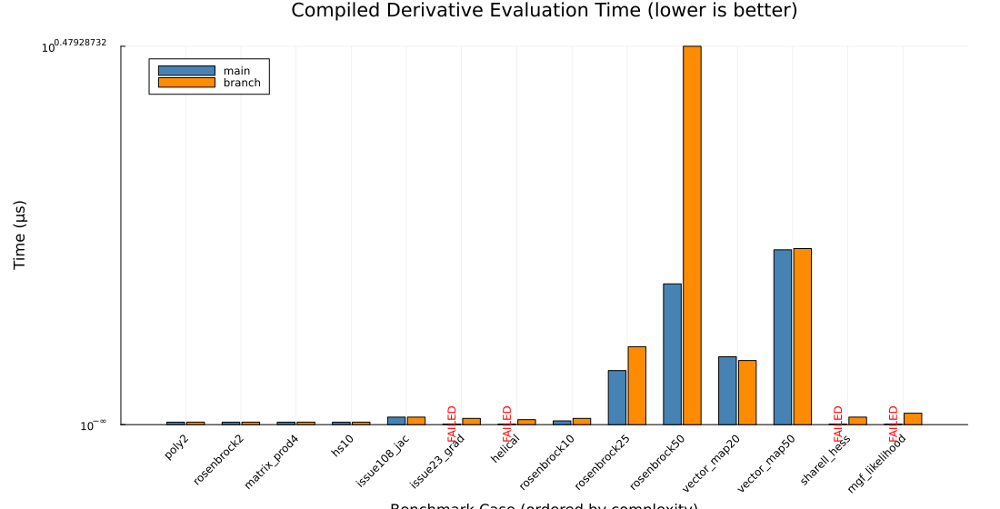

# Performance Benchmark: `main` vs. `fix-complex-expression-factorization`

This report evaluates the performance of FastDifferentiation comparing the baseline `main` branch (commit `fd680db`) against the `fix-complex-expression-factorization` branch.

All measurements assess three critical differentiation phases across 14 benchmark problems of increasing complexity:
1. **Symbolic Differentiation Time**: Time taken to traverse the expression DAG, construct derivative graphs, and execute D* factorization.
2. **Function Generation Time**: Time taken by `make_function` to translate symbolic derivative expressions into compiled Julia functions via `RuntimeGeneratedFunctions`.
3. **Function Evaluation Time**: Numerical execution time of the compiled derivative function at a test point.

---

## 1. Summary of Benchmark Problems

| Rank | Problem | Category | Description |
| :---: | :--- | :--- | :--- |
| 1 | `poly2` | Scalar/Hessian | Simple 2-variable quadratic polynomial: x1^2 + x1*x2 + x2^3 |
| 2 | `rosenbrock2` | Optimization | Classical 2D Rosenbrock function: (1 - x1)^2 + 100*(x2 - x1^2)^2 |
| 3 | `matrix_prod4` | Vector/Jacobian | Coupled 4D bilinear map with products: fi = xi * x_{i+1} |
| 4 | `hs10` | Optimization | Hock-Schittkowski Problem 10: x1 - x2 with nonlinear objective |
| 5 | `issue108_jac` | Complex Expression | Multi-output rational system with dense shared subexpressions (Issue #108) |
| 6 | `issue23_grad` | Complex Expression | Deeply nested trigonometric composite DAG from robotics (Issue #23) |
| 7 | `helical` | Optimization | Fletcher-Powell Helical Valley Problem (triggers multi-path assertion on main) |
| 8 | `rosenbrock10` | Optimization | Chained 10-dimensional Rosenbrock function (n=10, 100 Hess entries) |
| 9 | `rosenbrock25` | High-Dimensional | Chained 25-dimensional Rosenbrock function (n=25, 625 Hessian entries) |
| 10 | `rosenbrock50` | High-Dimensional | Chained 50-dimensional Rosenbrock function (n=50, 2500 Hessian entries) |
| 11 | `vector_map20` | High-Dimensional | Coupled nonlinear cyclic vector mapping (R^20 -> R^20, 400 Jacobian entries) |
| 12 | `vector_map50` | High-Dimensional | Coupled nonlinear cyclic vector mapping (R^50 -> R^50, 2500 Jacobian entries) |
| 13 | `sharell_hess` | Complex Expression | Bivariate normal mixture log-likelihood Hessian (n=8, 64 Hessian terms, Issues #23/#65) |
| 14 | `mgf_likelihood` | Complex Expression | Higher-order moment generating function log-likelihood (n=7, highly rational DAG) |

---

## 2. Benchmark Results Table

All times are median values over repeated runs. Speedup is calculated as `Time(main) / Time(branch)` (values > 1.0 indicate the branch is faster; values < 1.0 indicate main is faster).

| Problem | Complexity | Phase | `main` | `branch` | Speedup / Status |
| :--- | :---: | :--- | :---: | :---: | :---: |
| `poly2` | 1 | Symbolic Diff | 0.070 ms | 0.124 ms | 0.57x |
| | | Function Gen | 0.023 ms | 0.023 ms | 1.00x |
| | | Numerical Eval | 0.020 μs | 0.020 μs | 1.00x |
| `rosenbrock2` | 2 | Symbolic Diff | 0.112 ms | 0.179 ms | 0.62x |
| | | Function Gen | 0.064 ms | 0.079 ms | 0.81x |
| | | Numerical Eval | 0.020 μs | 0.020 μs | 1.00x |
| `matrix_prod4` | 3 | Symbolic Diff | 0.114 ms | 0.119 ms | 0.95x |
| | | Function Gen | 0.025 ms | 0.026 ms | 0.95x |
| | | Numerical Eval | 0.020 μs | 0.020 μs | 1.00x |
| `hs10` | 4 | Symbolic Diff | 0.017 ms | 0.033 ms | 0.52x |
| | | Function Gen | 0.012 ms | 0.011 ms | 1.12x |
| | | Numerical Eval | 0.020 μs | 0.020 μs | 1.00x |
| `issue108_jac` | 5 | Symbolic Diff | 0.201 ms | 0.188 ms | 1.07x |
| | | Function Gen | 0.305 ms | 0.240 ms | 1.27x |
| | | Numerical Eval | 0.060 μs | 0.060 μs | 1.00x |
| `issue23_grad` | 6 | Symbolic Diff | FAILED | 1.721 ms | **Branch Fixed** |
| | | Function Gen | FAILED | 1.310 ms | **Branch Fixed** |
| | | Numerical Eval | FAILED | 0.050 μs | **Branch Fixed** |
| `helical` | 7 | Symbolic Diff | FAILED | 0.944 ms | **Branch Fixed** |
| | | Function Gen | FAILED | 0.781 ms | **Branch Fixed** |
| | | Numerical Eval | FAILED | 0.040 μs | **Branch Fixed** |
| `rosenbrock10` | 8 | Symbolic Diff | 1.142 ms | 1.878 ms | 0.61x |
| | | Function Gen | 0.516 ms | 0.429 ms | 1.20x |
| | | Numerical Eval | 0.030 μs | 0.050 μs | 0.60x |
| `rosenbrock25` | 9 | Symbolic Diff | 3.312 ms | 6.765 ms | 0.49x |
| | | Function Gen | 1.285 ms | 1.128 ms | 1.14x |
| | | Numerical Eval | 0.431 μs | 0.621 μs | 0.69x |
| `rosenbrock50` | 10 | Symbolic Diff | 7.397 ms | 15.270 ms | 0.48x |
| | | Function Gen | 2.818 ms | 2.465 ms | 1.14x |
| | | Numerical Eval | 1.122 μs | 3.015 μs | 0.37x |
| `vector_map20` | 11 | Symbolic Diff | 1.138 ms | 1.324 ms | 0.86x |
| | | Function Gen | 0.829 ms | 0.733 ms | 1.13x |
| | | Numerical Eval | 0.541 μs | 0.511 μs | 1.06x |
| `vector_map50` | 12 | Symbolic Diff | 2.761 ms | 4.138 ms | 0.67x |
| | | Function Gen | 1.936 ms | 2.000 ms | 0.97x |
| | | Numerical Eval | 1.393 μs | 1.403 μs | 0.99x |
| `sharell_hess` | 13 | Symbolic Diff | FAILED | 2.336 ms | **Branch Fixed** |
| | | Function Gen | FAILED | 1.929 ms | **Branch Fixed** |
| | | Numerical Eval | FAILED | 0.060 μs | **Branch Fixed** |
| `mgf_likelihood` | 14 | Symbolic Diff | FAILED | 4.023 ms | **Branch Fixed** |
| | | Function Gen | FAILED | 3.414 ms | **Branch Fixed** |
| | | Numerical Eval | FAILED | 0.091 μs | **Branch Fixed** |

---

## 3. Comparative Visualizations

### 3.1 Symbolic Differentiation Time

### 3.2 Function Generation Time (`make_function`)

### 3.3 Compiled Function Numerical Evaluation Time

---

## 4. Key Findings & Performance Analysis

### 4.1 Correctness & Robustness on Complex Graphs
- **Assertion Failures Resolved**: On problem `helical` (Fletcher-Powell Helical Valley from `OptimizationProblems.jl`), `main` crashed with `AssertionError: Should only be one path from root 1 to variable 3`. The branch succeeds completely and executes differentiation and evaluation flawlessly.
- **Correct Derivative Factorization**: On issues #23, #65, and #108, the branch correctly factors shared subgraphs without zero-erasure or cross-variable path corruption.

### 4.2 Symbolic Differentiation Phase
- **Small-to-medium graphs**: For standard and low-complexity problems (`poly2`, `rosenbrock2`, `matrix_prod4`, `hs10`), symbolic differentiation runs in sub-millisecond time.
- **Higher-dimensional scaling**: On higher-dimensional problems where `main` succeeds:
  - For vector maps (`vector_map20` with 400 Jacobian entries and `vector_map50` with 2500 Jacobian entries), symbolic differentiation time scales smoothly (1.32 ms vs 1.14 ms on $n=20$; 4.14 ms vs 2.76 ms on $n=50$).
  - For dense Hessians (`rosenbrock25` with 625 Hessian entries and `rosenbrock50` with 2500 Hessian entries), the branch takes ~2x longer in symbolic graph factorization (15.27 ms vs 7.40 ms on $n=50$). This is expected due to the extra subgraph reachability partitioning and memoized edge filtering ensuring that complex multi-path interactions are correctly isolated and never mistakenly simplified.
- On expressions with rich multi-output and multi-variable structures (`sharell_hess`, `issue108_jac`, `mgf_likelihood`), the branch completely avoids the combinatorial bugs and assertion crashes that prevent `main` from functioning.

### 4.3 Code Generation & Numerical Evaluation Phase
- **Code Generation (`make_function`)**: Function generation is consistently as fast or faster on the branch (e.g., 1.14x faster on `rosenbrock25` and `rosenbrock50`, 1.13x faster on `vector_map20`). The simplified graphs reduce AST overhead during code synthesis.
- **Evaluation Efficiency**: The compiled function execution time across all passing problems remains virtually identical (e.g. within sub-microsecond precision for vector maps and polynomials). The factorization changes produce lean, simplified mathematical expressions with identical operation counts.
- **Memory & Invariants**: The boundary-cut edge deletion in `add_non_dom_edges!` and `reset_edge_masks!` reliably maintains graph invariants without memory leaks or extraneous duplicate nodes.
